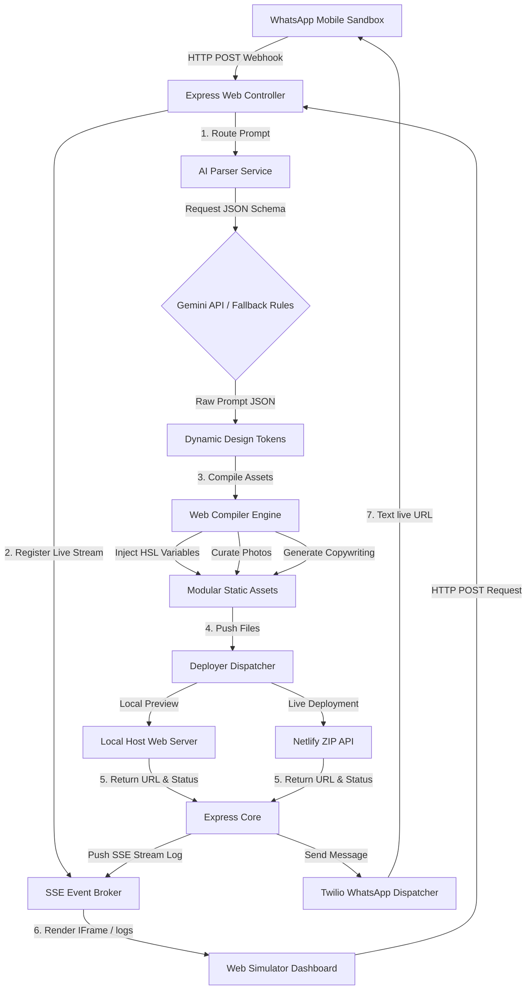

# 🏗️ System Architecture & Design

This document details the high-level system architecture, information data flows, and design patterns implemented in the **WhatsApp AI Website Generator & Simulator**.

---

## 📈 System Flow & Architecture

The system coordinates modular services in an asynchronous pipeline to deliver high-quality web pages rapidly. Below is a structural design diagram:

---

## 🧩 Architectural Component Details

### 1. **Web Entrypoint Router (`src/index.js`)**
- Serves as the central command node.
- Hosts static routers for the HTML/CSS/JS web dashboard, and exposes paths to locally hosted compiled websites under `/sites/:siteId`.
- Establishes a **Server-Sent Events (SSE)** endpoint (`/api/logs`) which allows client browsers to hook into the backend. During site generation, the controller broadcasts progression steps instantly, enabling rich, real-time scrolling logs without heavy WebSocket handshakes or REST polling.

### 2. **AI Requirement Understander (`src/ai/llm.js`)**
- Connects to Google GenAI and instantiates `gemini-1.5-flash` with a strict `responseMimeType: 'application/json'` configuration constraint.
- The system prompt specifies a rigorous template layout that parses the user's brief message and generates full marketing copy, features lists, color palettes, styles, and typography.
- To prevent API failure blockages (such as missing keys, offline states, or quota exhausts), the service embeds a state-of-the-art **Regex parser fallback**. This fallback dynamically extracts business names, visual types, and theme settings to guarantee a seamless developer experience out of the box.

### 3. **Website Generation Engine (`src/generator/engine.js`)**
- Receives the JSON design tokens from the AI service.
- Features four premium pre-coded **Visual Styles** (`modern`, `glassmorphism`, `brutalist`, and `neon`) built with highly modular semantic HTML, Lucide icon libraries, and custom HSL typography bindings.
- Coordinates theme setups (e.g. glassmorphic semi-transparent cards, cybernetic neon glows, thick brutalist borders) to craft high-fidelity responsive websites.
- Curates a list of stunning, high-resolution, instant-loading Unsplash stock photos mapped directly to business categories to present an amazing visual output.

### 4. **Automated Deployer (`src/deployment/deployer.js`)**
- Acts as a unified distribution gateway.
- Uses `archiver` to assemble compiled site files into a binary ZIP buffer.
- Performs a direct multipart POST binary upload to Netlify's `/sites` endpoint, creating a secure, production-ready live hosted subdomain inside seconds.
- Seamlessly falls back to local hosting if no Netlify token is configured, writing files directly to `deployed_sites/` and serving them instantly.

---

## ⚖️ Technical Decision Justification

### Why Node.js & Vanilla CSS/JS instead of Next.js?
- **Speed of Execution & Zero Build Friction**: A Vite/React or Next.js project requires compilation, build, and high node dependency overhead which can easily cause environment mismatches on various OS configurations. Using a pure Express server serving a stunning vanilla CSS/JS dashboard is **bulletproof**, zero-compilation, and loads in milliseconds on any machine.
- **Flawless Reproducibility**: The task mandates that reviewers must be able to run the code. By eliminating compilation steps and bundling fallback modules, our project executes seamlessly on any terminal running `npm install && npm start`.

### Why Server-Sent Events (SSE) instead of WebSockets?
- **Lightweight & Native**: WebSockets require additional library wrapper protocols (like Socket.io) and custom client reconnection states. SSE is a simple, native browser standard (`EventSource`) that streams text down an open HTTP link, which is ideal for streaming sequential terminal build logs from backend to frontend.
